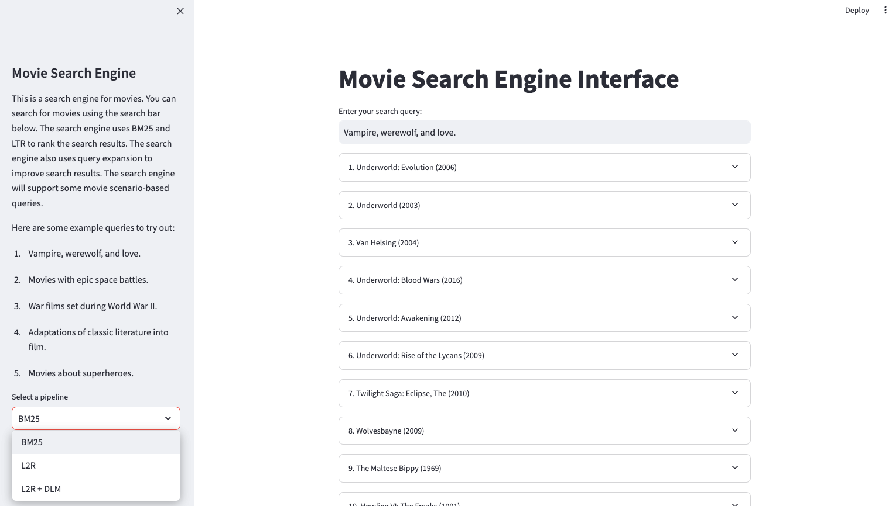
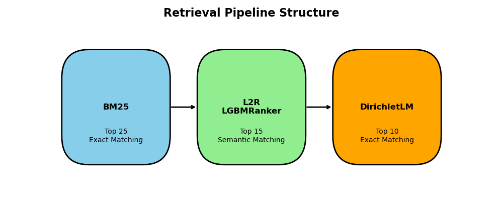
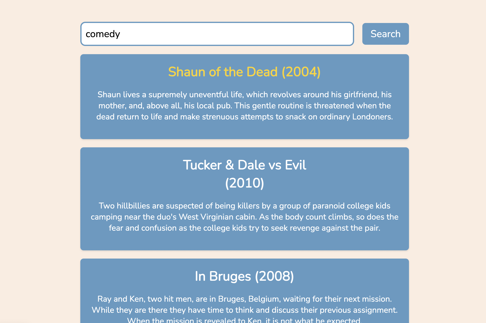
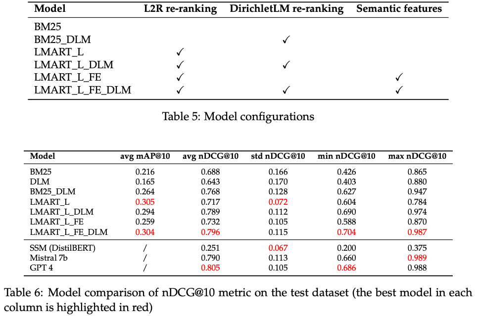
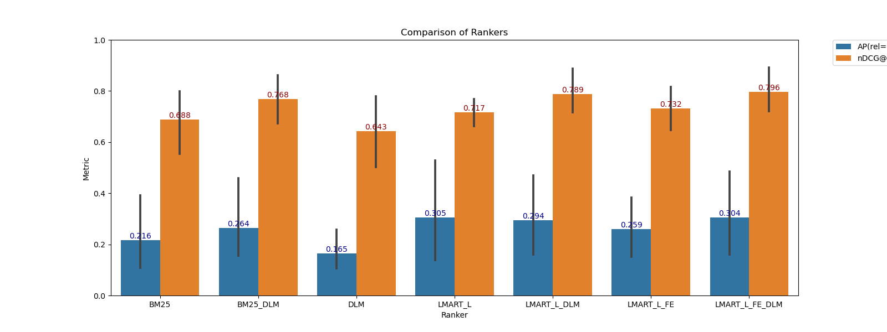
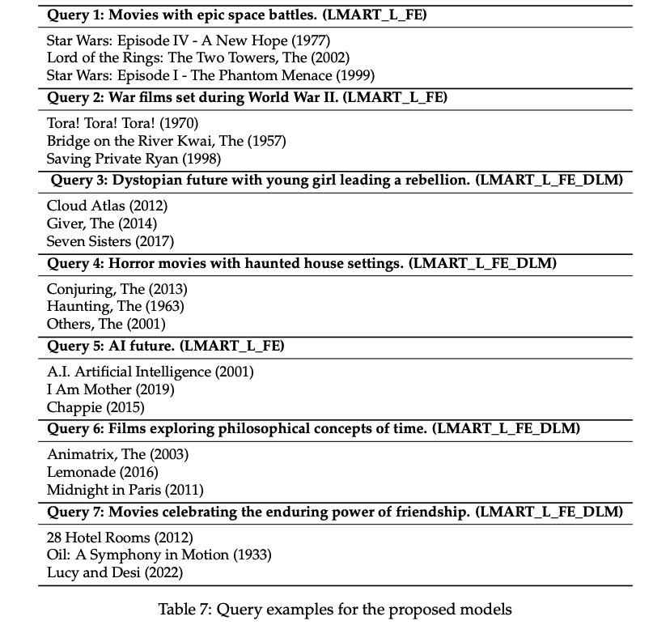
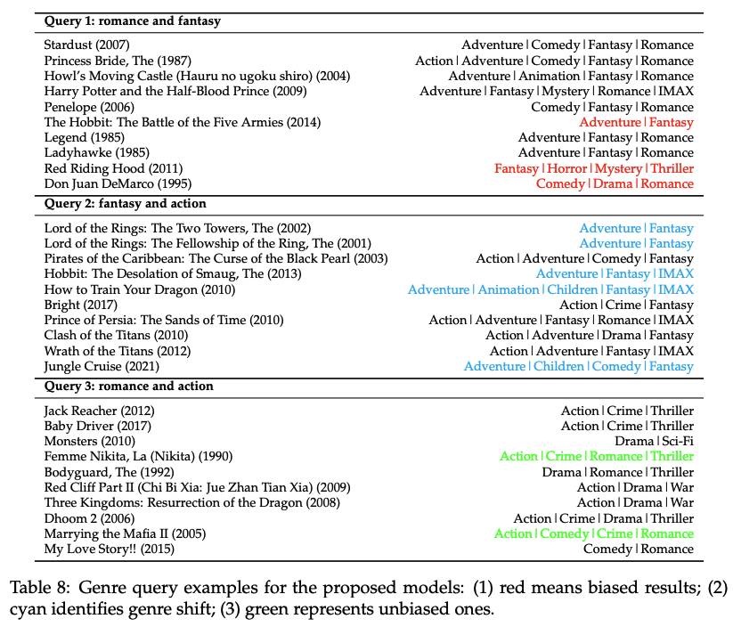

<h1 align="center">
    EECS549/SI650 Project: Movie Search Engine
</h1>

### Movie Search Engine
<div align="center">
    
</div>
<p>
    In the modern entertainment landscape, finding the perfect movie across numerous streaming platforms has become a challenging task. Current recommendation systems often fall short, relying on generic algorithms or user ratings that overlook individual preferences. Our project addresses this challenge by redefining the movie discovery experience. Unlike traditional approaches, our innovative pipeline combines exact matching with semantic understanding and refined re-ranking. This approach not only achieves a notable increase of 0.11 in nDCG@10 over the baseline BM25 but also aligns more closely with user intent and content relevance. Our detailed ablation study further highlights the efficacy of refined re-ranking and feature extraction in this context. We also discuss and address ethical considerations in genre shift and fairness. Additionally, we emphasize a seamless user experience through the design of an intuitive front-end web page. Through rigorous evaluation, our project identifies the strengths and weaknesses of our approach, paving the way for future advancements in movie retrieval systems. Our goal is to make discovering the perfect movie as enjoyable as the viewing experience itself.
</p>

<div align="center">
    
</div>


### Code and Data
<p>
    Primary data for now was obtained from MovieLens Latest Datasets on GroupLens, which includes about 86,000 movies.
</p>
<p>
    The main source code can be found in <em>movieSearchLib</em> directory. It mainly contains indexing, feature extraction, and ranking.
</p>
<p>
    One can use the .ipynb files in the <em>analysis</em> directory to see the detailed analysis and ablation study.
</p>
<p>
    Please see the queries in the query.txt in the data directory.
</p>

### Setup

1. Install Python 3.11 (preferred)
2. Install Java to support PyTerrir
3. see requirements.txt

### Getting Started
#### Flask Frontend
1. Run the following command to start the backend:
    ```bash
    python3 backend.py
    ```

2. Open `index.html` in your web browser.

3. You can now use the search engine!

<div align="center">
    
</div>

#### Streamlit
1. run the following command to start
    ```bash
    streamlit run run.py
    ```
2. You can select the models in the sidebar


### Results
<p>
    We create a retrieval pipeline based on BM25. Then, we consider re-ranking the retrieved results with our Learning-to-rank (L2R) with LGBMRanker and DirichletLM. We design the pipeline in this manner because we need to filter out the most 25 relevant movies with exact matching (BM25), then find the top 15 movies with semantic matching (L2R), and finally use the exact matching (DirichletLM) to find the top 10 results. We will do the ablation study on this to see how each part would improve the performance.
</p>

<div align="center">
    
</div>
<div align="center">
    
</div>


### Disucssion

- **Feature extraction**: incorporating semantic understanding into retrieval systems marks a substantial advancement. It allows the system to interpret not just the literal terms of the queries but also their underlying meanings, bridging the gap between user intent and content relevance to enhance retrieval accuracy and user satisfaction.
- **DirichletLM re-ranking**: the performance of DirichletLM, particularly in re-ranking scenarios, indicates its suitability for more targeted applications with limited context. It excels in the refinement of the initial broader selection. This finding opens up avenues for further research, particularly in optimizing the balance between initial retrieval and subsequent re-ranking. The potential to dynamically adjust the role of DirichletLM based on the characteristics of the dataset and the specific needs of the retrieval task offers a promising direction for future developments.
- **Potential weakness**: they still fall short in accurately capturing and responding to certain thematic or abstract queries. This limitation is particularly evident in scenarios where the query requires a nuanced understanding of thematic elements or underlying narrative tones, rather than straightforward keyword or genre-based retrieval. Vague or highly abstract queries require a level of interpretation and understanding that the models may not be equipped to handle. It is the limitation of this work.
<div align="center">
    
</div>

- **Potential bias and fair genre representation**: ensuring that both genres are fairly represented is crucial for meeting user expectations and providing a diverse range of content. But, we have observed that action films are preferred in the third query of Tbl. \ref{tab:query_example_3}. If one genre consistently dominates over the other in query results where both genres are specified, it may indicate a bias in the retrieval algorithm. This can lead to a misrepresentation of content and limit the diversity of recommendations.
<div align="center">
    
</div>

### Contributions
- Jia Zhu (zjjj@umich.edu)
   - Led the data collection efforts with a focus on thoroughness and completeness.
   - Enriched the project's database through API integration and various tools.
   - Implemented the baseline, establishing a solid foundation for the project.
   - Demonstrated technical proficiency in developing front-end pages for an intuitive user interface.
- Haoyang Ling (hyfrankl@umich.edu)
  - Collaborated on data collection and baseline implementation, ensuring a cohesive team approach.
  - Explored and implemented a diverse array of new models, showcasing adaptability and innovation.
  - Conducted a comprehensive comparative analysis of various models, providing valuable insights.
  - Played a key role in shaping the project's final approach through meticulous evaluation of model strengths and weaknesses.